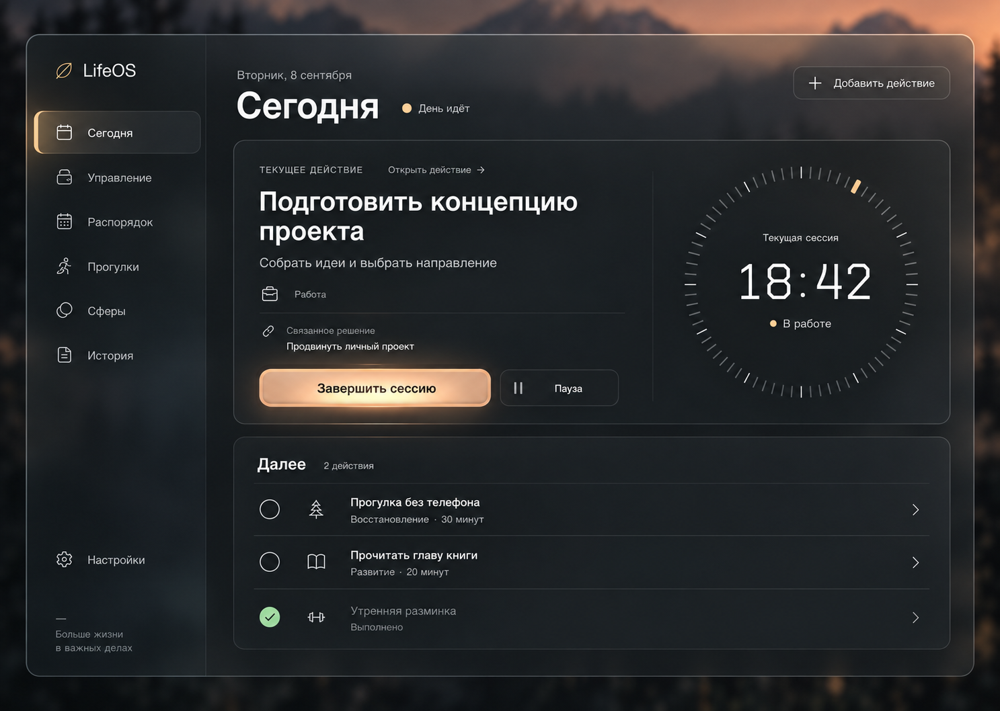
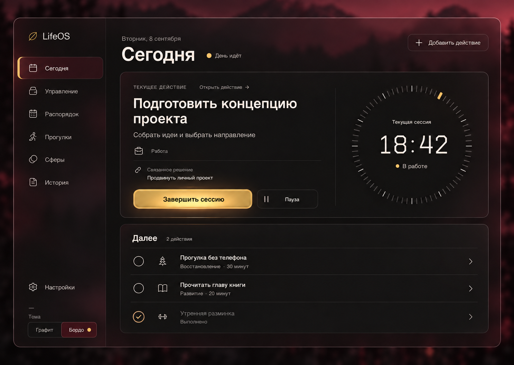

# LifeOS: «Графит» и «Бордо»

> Визуальный scope этого прежнего этапа заменён общим контрактом от 2026-09-09.
> Действуют LifeOS_DESIGN_RULES_v1.md v1.2 и docs/design/features/2026-09-09-shared-glass-direction.md.
> Старые ограничения локальности/палитры не применяются к этапам А–В; функциональные контракты сохраняются.

## Статус и границы утверждения

- Дата: 8 сентября 2026 года.
- Владелец визуального решения: пользователь LifeOS.
- Визуальное направление и два desktop-макета: **APPROVED**.
- Реализация: **NOT STARTED**.
- Mobile, интерактивный прототип и остальные страницы: **PENDING**.
- Документ фиксирует результат выбора дизайна и порядок переноса, а не готовность продукта.

Пользователь выбрал графитовый макет словами «вот эта мне нравится а эти 2 нет», отклонив
Forest Ink и Sand Glow. Затем задал второй теме чёрный, бордовый и золотой цвета и подтвердил
полученный макет словами «да нормально». Повторно выбирать эти два направления не требуется.
Утверждение изображений не подтверждает browser QA, доступность или готовность всех экранов.

## Выбранные изображения

### Графит



### Бордо



Это статические изображения, созданные встроенным ImageGen на основе пользовательских
референсов. Они содержат демонстрационные данные. Копии сохранены в репозитории без изменения
исходников. Они служат визуальными ориентирами, а не изображениями для подстановки вместо UI.

## Цель и дизайн-контракт

```text
FEATURE: переработка существующего интерфейса и переключение двух тем
→ USER GOAL: цельный современный интерфейс с материальностью и сдержанным светом
→ EXISTING LOGIC: существующие Day / Decision / LifeAction / ActionSession и application API
→ PAGE/COMPONENT ARCHETYPE: оболочка приложения + центр управления / текущий фокус
→ SECTION COLOR: тема определяет палитру; дополнительные цвета разделов не добавляются
→ MAIN VISUAL CENTER: текущее действие и связанный с ним таймер сессии
→ COMPONENTS TO REUSE: ApplicationShellView, CurrentActionCard, TodayActionNavigator, AppIcon
→ MOBILE BEHAVIOR: один поток; действие, таймер и кнопки перед следующими действиями
→ APPROVED REFERENCE: YES, оба desktop-макета выше
→ TEST SCOPE: настройки темы, существующие состояния Сегодня, browser/desktop/mobile QA
```

Тип изменения: оформление существующих страниц и компонентов; новая функция общих настроек —
переключение темы. Начальный визуальный образец — «Сегодня» с активной сессией. Полный редизайн
охватывает остальные разделы последующими этапами; их композиции здесь не объявляются утверждёнными.

## Палитры и материалы

В каждой теме ровно три основные цветовые семьи. Разрешены их оттенки, смешения, прозрачность,
свет и тень. Новые цветовые семьи для разделов, отдельных карточек и статусов не вводятся.

| Тема   | Основные цвета                                         | Распределение ролей                                                    |
| ------ | ------------------------------------------------------ | ---------------------------------------------------------------------- |
| Графит | нейтральный графит, молочный, тёплый персиковый        | фон/панели; текст/иконки; primary/выбранность/локальный свет           |
| Бордо  | чёрный `#1A1A1A`, бордовый `#7A1F2B`, золото `#CBA135` | структурная основа; глубина материала/выбранность; primary/свет/акцент |

Hex второй темы заданы пользовательским референсом. Точные токены «Графита» и производные
оттенки обеих тем предстоит определить при реализации и проверить по контрасту; изображение
не является численной спецификацией каждого пикселя. В «Бордо» основной текст — очень светлый
оттенок шампанского, вторичный — десатурированный светлый оттенок той же семьи.

- Оболочка — дымчатое матовое стекло с тонкой оптической кромкой.
- Рабочие поверхности плотнее оболочки: текст сохраняет читаемость поверх фонового мотива.
- У главной кнопки сдержанное внутреннее свечение, объёмная кромка и тёмное углубление вокруг.
- У остальных кнопок и длинных списков свет и глубина слабее; строки не становятся отдельными карточками.
- Фон — тёмная размытая природная даль: закатная в «Графите», с приглушённым винным тоном в «Бордо».
- Типографика — чистый интерфейсный sans; приборный характер допустим в цифрах таймера.
- Радиальная шкала не обозначает процент выполнения без реального целевого значения.
- Все состояния различаются текстом, формой и иконкой, а не только цветом.

## Соотношение с прежними правилами

Этот документ фиксирует явные пользовательские решения для нового направления относительно
[LifeOS Design Rules v1.1](../../../LifeOS_DESIGN_RULES_v1.md):

1. Стекло допускается в постоянной оболочке; плотные рабочие области сохраняют читаемость.
2. Палитра темы заменяет прежнюю систему разноцветных разделов и отдельных цветовых статусов.
3. В рамках трёхцветного ограничения success/error/destructive различаются также надписью,
   пиктограммой, контуром, положением и подтверждением опасного действия. Бордовый фон темы сам
   по себе не означает ошибку. Ошибки должны явно называться ошибками и иметь действие восстановления.

Зелёная галочка в раннем утверждённом изображении «Графита» — деталь, которую позднейшее
пользовательское требование «три основных цвета, и не больше» уточнило. В реализации используется
галочка и подпись в палитре темы, как в макете «Бордо».

Остальные принципы прежних правил сохраняются: иерархия, реальные данные, доступность, единые
компоненты, responsive и проверка результата. До изменения runtime нужно согласовать текст
затрагиваемых пунктов общей дизайн-системы с этим уже принятым контрактом; это документационное
обновление по выданному разрешению, а не повторный запрос выбора палитры.

## Поведение и владельцы состояния

Существующая реализация найдена в следующих модулях:

- `src/presentation/layouts/ApplicationShellView.tsx`: desktop/mobile-навигация и общая оболочка.
- `src/app/ApplicationShell.tsx`: связывание экранов с application API и настройками.
- `src/presentation/pages/TodayPage.tsx`: текущий день и сценарии страницы.
- `src/presentation/pages/CurrentActionCard.tsx`: текущая сессия, таймер и существующие команды.
- `src/presentation/pages/TodayActionNavigator.tsx`: навигация по действиям.
- `src/presentation/components/AppIcon.tsx`: существующая система иконок.
- `src/presentation/settings/localSettings.ts` и `src/app/settings/BrowserLocalSettingsStore.ts`:
  существующий контракт настроек и хранение `lifeos.local-settings.v1`.
- `src/presentation/styles/global.css`: существующие общие стили.

При осмотре store, оболочки и общих стилей реализации переключения тем не обнаружено. Перед
добавлением полей проверить весь контракт `localSettings`, его потребителей и текущий diff.
Тема — UI-предпочтение, отдельного источника предметного состояния не создаёт. Использовать
существующий механизм настроек; старые сохранённые значения без темы должны продолжать читаться.
Начальная тема — «Графит». Выбор «Графит / Бордо» применяется ко всем экранам и сохраняется после
перезапуска при доступном хранилище. Если сохранение недоступно, не заявлять об успешном сохранении.

Смена темы сохраняет выбранный раздел, текущую сессию, таймер, введённый текст и открытый сценарий.
Она не перезапускает приложение и не изменяет domain-данные. Предметные действия по-прежнему
проходят через существующие application-команды; ради оформления не менять IndexedDB-схему.

Сохранить все действующие пункты навигации и инструменты, даже если их нет на концептуальном
изображении. В частности, не удалять настройки, вечернюю аналитику, «Ещё», голосовые инструменты
или системные индикаторы. Демонстрационные задания и время `18:42` не переносить в runtime.

## Состояния и адаптивность

- Loading: геометрия основных блоков сохраняется, загрузка явно обозначена без ложного прогресса.
- Empty: существующее объяснение и одно подходящее действие, без фиктивных задач.
- Error/retry: явная подпись ошибки и способ повторить; форма и введённые данные сохраняются.
- Success: галочка и текст подтверждения в палитре темы.
- Disabled: понятная причина недоступности и читаемая подпись.
- Hover/pressed/selected/focus: единые состояния; keyboard focus отчётливый и отдельный от selected.
- Running/paused/completed: реальные состояния сессии и прежняя семантика команд.

Desktop ориентируется на выбранные макеты. На tablet правая область перестраивается по ширине.
На mobile сначала текущее действие, таймер и управление сессией, затем следующие действия.
Существующая нижняя навигация сохраняется; переключатель тем доступен через меню/настройки.
Mobile-композиция требует собственной визуальной проверки, а не уменьшения desktop-картинки.
Проверить размеры 1440×1024, 768×1024, 390×844 и узкий 360×800, отсутствие нежелательного
горизонтального скролла, touch-зоны от 44px, контраст, keyboard/focus и reduced motion.

## Порядок переноса

Уточнение пользователя после выбора тем: сначала продолжить макеты ключевых экранов всего
приложения, затем выполнять массовый перенос в код. Для новых уникальных композиций сохраняется
visual approval. Текущий следующий экран — [обзор управления](../pages/2026-09-08-management-overview-redesign.md)
в двух темах на desktop и mobile; его макеты ещё не утверждены. Далее проектируются альбом и
детали целей, направления, распорядок и ритуалы, прогулки и сферы, история/аналитика и настройки.

После визуального проектирования порядок реализации следующий:

1. Общая основа: токены двух тем, необходимые уточнения дизайн-правил, совместимые настройки,
   переключатель, оболочка, кнопки и общие состояния. Проверить влияние на существующие разделы.
2. «Сегодня»: перенести выбранную композицию на реальные состояния и команды. Включить desktop,
   mobile, работающую/приостановленную сессию, пустые состояния и восстановление ошибок.
3. Остальные разделы: переносить по одному, используя общие токены и компоненты; уникальные
   композиции отдельно показывать пользователю согласно New Feature Design Gate.
4. Общая проверка согласованности после переноса всех разделов.

Это порядок этапов, а не детальный implementation plan. Перед изменением кода каждого этапа
уточнить затрагиваемые файлы, актуальные контракты и критерии приёмки. В рабочем дереве уже есть
много посторонних изменений; их сохранять и не объявлять проверенными этой задачей.

## Проверки

Для текущего документа и PNG: наличие ссылок и изображений, совпадение копий с источниками,
локальный Prettier, просмотр diff и `git diff --check`. Продуктовые тесты не требуются.

Для реализации выбирать targeted tests по фактическому патчу. Существующие ориентиры:

```text
npm run test:target -- src/app/settings/BrowserLocalSettingsStore.test.ts
npm run test:target -- src/app/ApplicationShell.test.ts
npm run test:target -- src/presentation/pages/TodayPage.test.ts
npm run test:target -- src/presentation/pages/TodayPageLayout.test.ts
npm run test:target -- src/presentation/pages/CurrentActionCardState.test.ts
```

Добавить проверки нового наблюдаемого поведения переключателя, восстановления настроек без
theme, неизменности активной сессии при смене темы и доступности контролов. После стабилизации
кода выполнить `npm run verify`. Для этапов с responsive/browser-поведением и сохранением темы
нужен `npm run test:e2e` по [матрице проверок](../../codex/TEST_MATRIX.md); основание объяснить
перед запуском. Проверить обе темы в браузере, console, основные состояния и checklist №38.

## Приёмка реализации

- [x] Пользователь выбрал обе темы; выбранные изображения сохранены в репозитории.
- [x] Зафиксированы трёхцветное ограничение и отклонённые варианты.
- [ ] Реализованы общие токены и переключение тем с сохранением выбора.
- [ ] Сохранены существующие действия, настройки, данные и навигация.
- [ ] Перенесены реальные состояния «Сегодня» и проверены обе темы.
- [ ] Проверены mobile, contrast, keyboard/focus и reduced motion.
- [ ] Выполнены проверки соответствующего этапа по матрице.
- [ ] Остальные разделы перенесены и проверены отдельными этапами.
