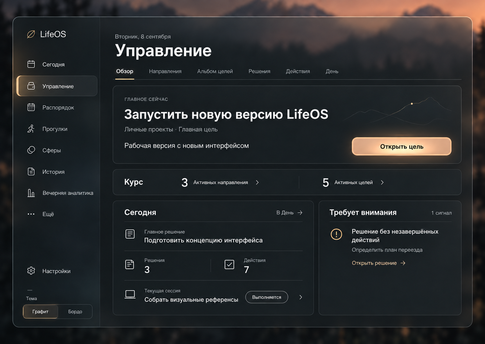
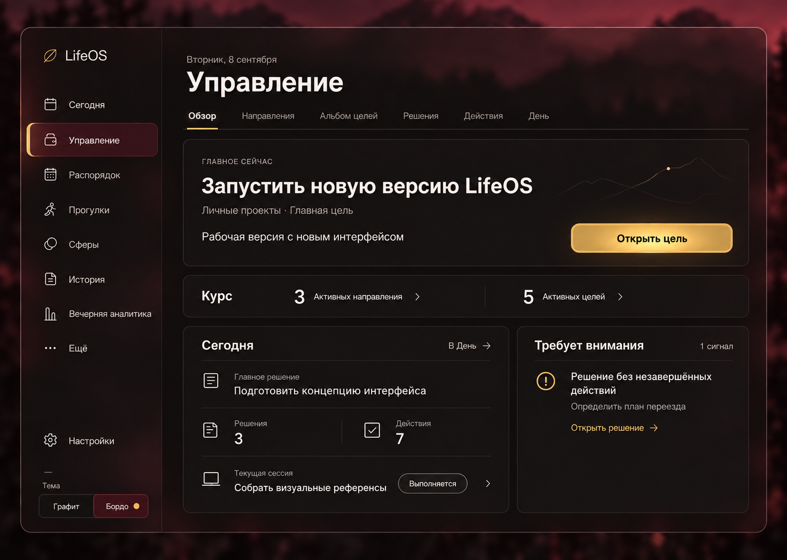
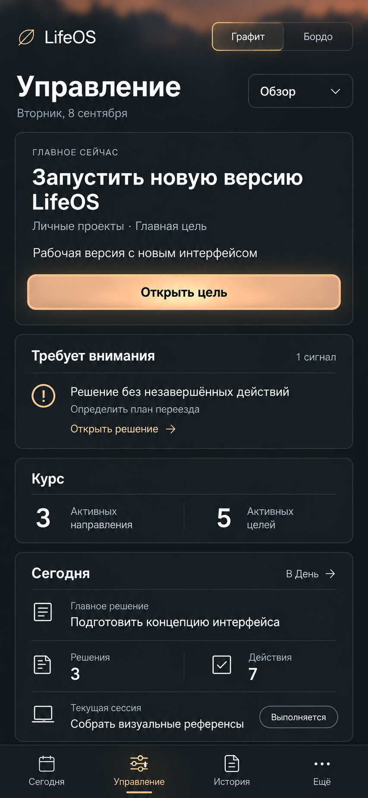
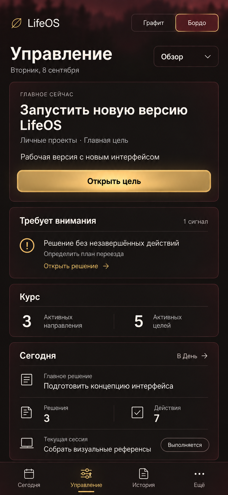

# Управление: обзор в темах «Графит» и «Бордо»

## Статус

- Design: **CONTRACT DEFINED**.
- Visual review: **PENDING** — четыре макета показаны пользователю, нового утверждения ещё нет.
- Implementation: **NOT STARTED**.
- Lock: **UNLOCKED**.
- Тема и материалы основаны на [утверждённом направлении](../features/2026-09-08-interface-redesign.md).

Задача текущего этапа — визуально спроектировать обзор управления на desktop и mobile в обеих
темах. Пользователь уточнил порядок работы: продолжить проектирование остальных ключевых
экранов до массового переноса дизайна в код. Макеты не являются работающими страницами.

## Дизайн-контракт

```text
FEATURE: переработка существующего обзора управления
→ USER GOAL: видеть главный фокус, дела на сегодня, курс и связи, требующие внимания
→ EXISTING LOGIC: GetManagementOverview и ManagementOverviewSnapshot
→ PAGE/COMPONENT ARCHETYPE: центр управления с одним фокусом и компактными сводками
→ SECTION COLOR: палитра выбранной темы, без новых цветов для разделов/метрик
→ MAIN VISUAL CENTER: главная цель и действие «Открыть цель»
→ COMPONENTS TO REUSE: ApplicationShellView, ManagementNavigation, SectionPageHeader, AppIcon
→ MOBILE BEHAVIOR: фокус → сигнал → курс → сегодня; компактный выбор внутреннего раздела
→ APPROVED REFERENCE: темы YES; новая композиция обзора PENDING
→ TEST SCOPE: на этом этапе изображения/документация; browser-проверки после реализации
```

## Источник данных и навигация

Авторитетный контракт — `src/application/queries/GetManagementOverview.ts`.
Существующее отображение — `src/presentation/management/ManagementOverview.tsx`.
Навигация — `ManagementNavigation.tsx`, `ManagementSection.ts` и `ManagementPage.tsx` в том же
каталоге. Связанные проверки — `src/application/queries/GetManagementOverview.test.ts` и
`src/presentation/management/ManagementPage.test.ts`.

- Фокус: активная главная цель; при её отсутствии главное активное направление; затем empty.
- Сегодня: главное решение, количество решений и действий на дату, название/статус текущей сессии.
- Курс: количество активных направлений и целей.
- Сигналы: заголовок, пояснение и переход к соответствующему объекту.

Счётчики «Сегодня» — все запланированные на дату объекты, включая завершённые. Они не означают
остаток работы. В overview нет процентов прогресса, сроков цели, длительности сессии, streak
или графиков динамики. Не добавлять подобные показатели ради оформления.

Внутренние разделы: «Обзор», «Направления», «Альбом целей», «Решения», «Действия», «День».
Самостоятельный раздел «Проекты» не возвращается. Технические projectId/project-имена остаются
в совместимых контрактах; пользовательский объект — цель. «Личные проекты» в демонстрационных
данных — произвольное название направления, не отдельный тип сущности или пункт навигации.

Существующие общие разделы, настройки и инструменты сохраняются. На mobile дополнительные
переходы доступны через «Ещё» и выбор внутреннего раздела. UI не меняет предметное состояние
напрямую; существующие application-команды и правила переходов остаются авторитетными.

## Композиция

Desktop: общая оболочка и sidebar из утверждённого направления, заголовок и шесть вкладок.
Широкая главная карточка содержит фокус и один сильный CTA. Под ней компактная полоса «Курс».
Нижняя область: «Сегодня» слева, один сигнал справа. Один экран не превращается в каталог
всех возможностей приложения.

Mobile: вместо sidebar используется существующая нижняя навигация из четырёх направлений.
Внутренние разделы управления доступны через компактное меню «Обзор». Переключатель двух тем
находится в верхней области. Сигнал поднимается сразу после фокуса, затем идут «Курс» и «Сегодня».
Порядок меняется, данные не исчезают. При длинных реальных названиях контент прокручивается;
нижняя навигация не перекрывает последнюю строку.

Три семьи цвета в каждой теме сохраняются. Фокусный CTA наследует материальную кромку и мягкую
подсветку. Сигнал имеет явную пиктограмму, заголовок и действие; бордовый не обозначает ошибку.
Числа вторичны по отношению к фокусу. Рабочие панели плотнее дымчатой оболочки.

## Макеты

Созданы встроенным ImageGen с прикреплёнными утверждёнными LifeOS-изображениями. Результаты
сохранены без изменения файлов; данные вымышлены, дата примера — 8 сентября 2026 года.
Темы показывают одинаковое содержимое, чтобы оценивать именно оформление.

### Desktop — Графит



### Desktop — Бордо



### Mobile — Графит



### Mobile — Бордо



## Результат проверки концепции

Независимый read-only разбор подтвердил совместимость показанных данных с overview-контрактом:
главная цель, текущее решение и сессия могут сосуществовать с отдельным решением без действий.
Неподдерживаемых числовых показателей нет, внутренняя навигация соответствует текущему коду.

Замечание до реализации: тонкий пейзажный контур с точкой в desktop-карточке похож на график
прогресса. Это декоративный артефакт генерации, не данные. При доработке убрать этот контур и
точку; его нельзя переносить в runtime как показатель цели. Mobile не содержит этого элемента.

## Состояния и проверки реализации

На изображениях показан только ready-state с данными. Остальные состояния ещё не отрисованы:

- Loading: геометрия не прыгает, понятная подпись загрузки.
- Empty focus: «Фокус не определён» и существующее действие определения направления/цели.
- No signals: спокойная подпись «Критичных сигналов нет», без добавления нового цвета.
- No session: строка сессии не появляется без реальной сессии.
- Paused session: явная подпись «На паузе», без ложного состояния выполнения.
- Error: понятное сообщение; повторная загрузка должна иметь определённый обработчик до
  отображения кнопки retry. Не изображать уже реализованный retry без проверки контракта.
- Hover/pressed/selected/focus/disabled: общая система обеих тем, видимый keyboard focus.

Будущая browser QA: обе темы, desktop 1440×1024, tablet 768×1024, mobile 390×844 и 360×800,
длинные строки, контраст, touch-зоны от 44px, отсутствие перекрытия нижней навигацией, keyboard
и reduced motion. Изображения не доказывают эти свойства; проверять реальный рендер.

Для реализации использовать targeted overview/navigation tests, затем `npm run verify`.
При изменении responsive и browser-переходов выполнить `npm run test:e2e` согласно
[матрице проверок](../../codex/TEST_MATRIX.md). Сейчас runtime не менялся; достаточно проверки
Markdown, ссылок, PNG, совпадения копий и Git hygiene.
