# Проверка управления подъёмом

## Продуктовая реализация — 28.09.2026

Маршрут: `/#/v2/sleep`. Пользователь разрешил внедрение трёх улучшений и исправление QR.
Визуальный reference не объявляется APPROVED/LOCKED. Ниже также сохранена история
проверки демонстрационного макета; её утверждения относятся к тому этапу.

До изменения снят реальный baseline на desktop/mobile. В браузерном профиле настройки
сна отсутствовали; пользовательские данные для проверки не создавались.

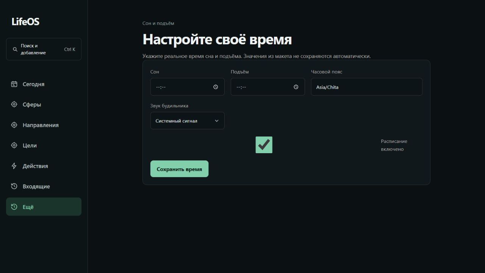

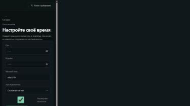

Настроенное приложение проверено на изолированных E2E-данных. Одна главная карточка
объединяет время, дату и действия; вечерний сценарий остаётся ниже. Использованы
действующие графитовые поверхности, jade и shared controls. Цвет состояния сопровождается текстом.

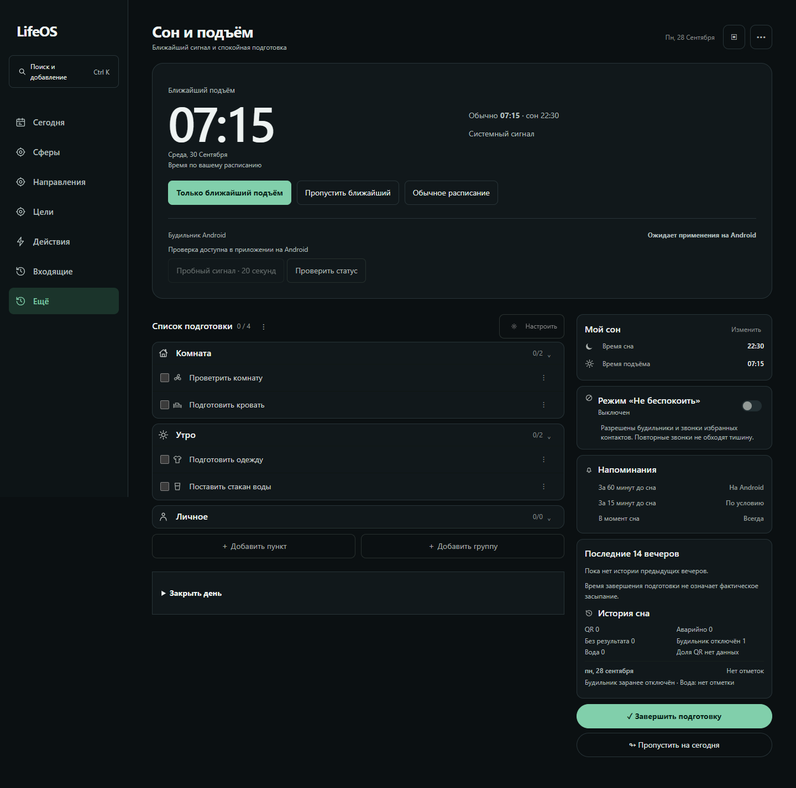

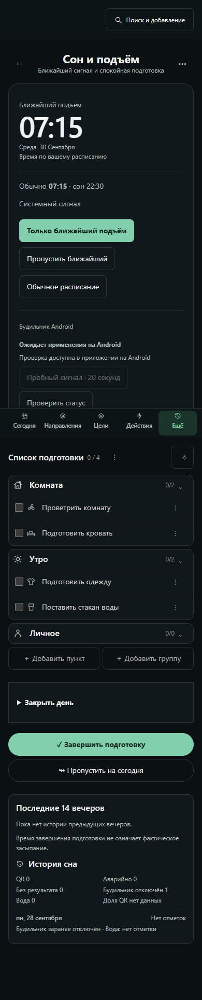

На desktop 1440 px и mobile 390 px горизонтального переполнения нет. Основные controls
имеют минимальную высоту 44 px; действия на узкой ширине перестраиваются вертикально.
Console/pageerror чистые. Escape, начальный фокус на отмене и возврат фокуса проверены E2E.
Продуктовый экран на 320 px физически не проверялся; снимок 08 ниже относится только к макету.

`npm run verify` прошёл. Scoped wake/evening E2E: 14/14 на desktop/mobile.
Native JUnit: 25/25 с Kotlin compile. Окончательный ARM64 APK собран и установлен поверх
существующего LifeOS на Galaxy A23 через `adb install -r`, без сброса данных.
Разовая дата, reload, устаревшая форма, включение
расписания, browser honesty и вечерний flow покрыты автоматическими проверками.
Чек-лист правила №38 применён к затронутому экрану; полное соответствие WCAG не заявляется.

QR исправлен в native экспорте: существующий файл открывается через системное меню Android,
повторный экспорт не заменяет ключ. На телефоне ещё требуется вручную проверить chooser,
сохранение/печать, слышимость сигнала при заблокированном экране и кнопку подтверждения.
TalkBack и физическое восстановление после перезагрузки также остаются ручной QA.

## История демонстрационного макета

Дата: 28.09.2026. Маршрут: `/docs/design/references/2026-09-28-wake-alarm/preview.html`.
Цель — сделать управление понятнее и визуально собраннее без новых разделов и режимов.
Это проверка демонстрационного интерфейса, не аудит доставки Android-будильника.

## 1. Исходный desktop — требовал доработки

Время и дата повторялись в двух местах. Статус и действия визуально отделялись от
часов; переключатель демонстрационных состояний конкурировал с рабочими настройками.
Снимок: 1280 × 720.

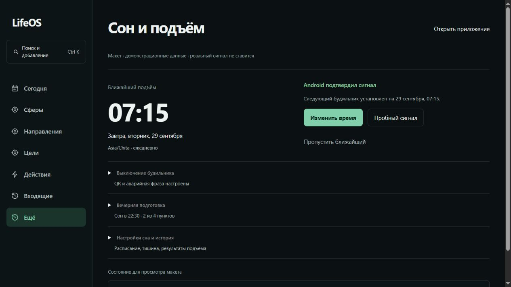

## 2. Исходный mobile — требовал доработки

На 390 × 844 подтверждение повторяло дату; управление занимало длинный вертикальный
блок без единой поверхности. Навигация и основные controls взяты из текущего LifeOS.

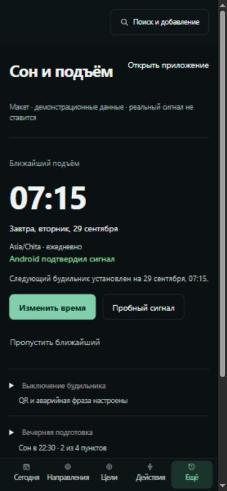

## 3. Обновлённый desktop — готов к визуальному рассмотрению

Одна карточка объединяет время, дату, статус и действия. Внутри сохранены две колонки;
повтор времени удалён. Ниже — три раскрываемые группы существующих настроек.

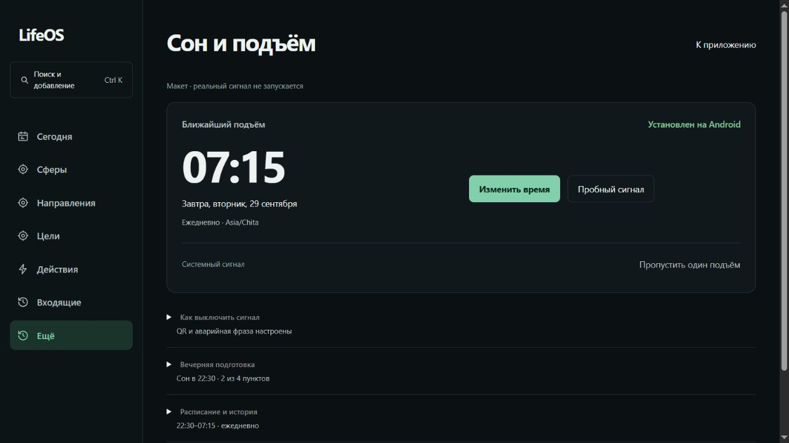

## 4. Обновлённый mobile — готов к визуальному рассмотрению

На 390 × 844 карточка перестраивается в одну колонку; основные действия имеют высоту
44 px. Дата показана один раз. Вспомогательные настройки раскрываются по запросу.

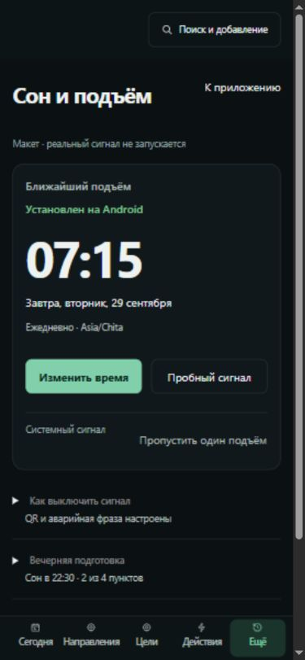

## 5. Браузер — ограничение показано корректно

Статус явно сообщает платформу. Изменение времени не переводит интерфейс в READY;
системный пробный сигнал и пропуск скрыты. Снимок использует демонстрационные данные.

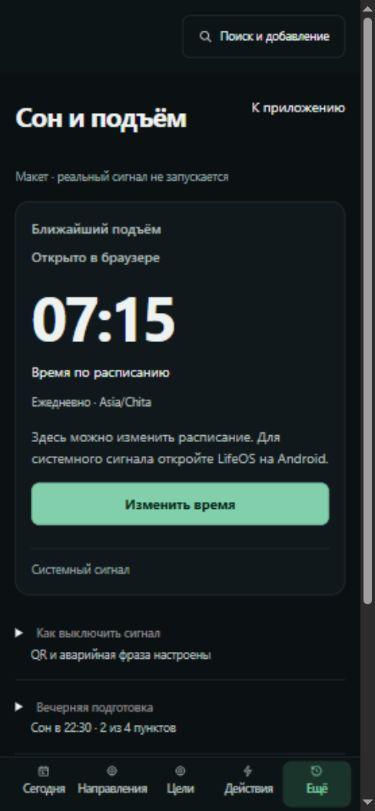

## 6. Пропуск — последствия показаны до подтверждения

Видны дата пропуска и следующий сигнал. Начальный фокус находится на отмене;
Escape сохраняет дату и возвращает фокус. Подтверждение меняет ближайший подъём
29 → 30 сентября, сохраняя время. Панель показана после автоматического scroll к фокусу.

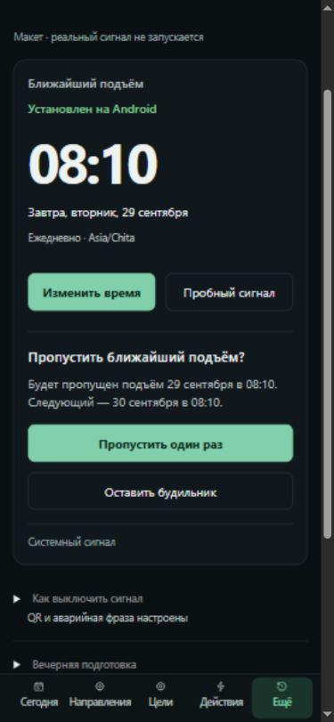

## 7. Ошибка — следующее действие ясно

Сообщение «Будильник не подтверждён» не утверждает отсутствие сигнала, когда нет
подтверждения. Основная кнопка — «Проверить снова». Ошибка различается и текстом,
и действующим красным токеном `--danger`; изменение времени вторично.

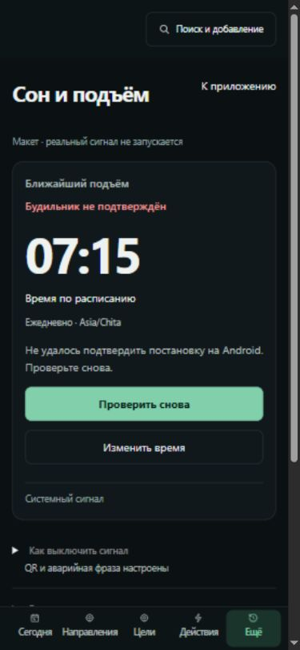

## 8. Компактный mobile — основной сценарий помещается по ширине

На 320 × 740 действия идут в одну колонку и имеют высоту 44 px. Горизонтального
переполнения нет. Унаследованные подписи нижней навигации на 320 px плотные;
общая оболочка в этой итерации не изменялась.

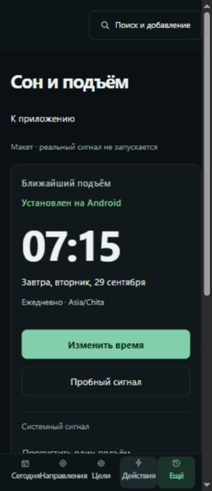

## Проверки и пределы доказательств

Проверены семь демонстрационных состояний на desktop/mobile, редактирование и звук,
сохранение без ложного подтверждения, возврат фокуса/Escape, подтверждение пропуска,
вечерний счётчик. Консоль, синтаксис JS и формат файлов проверяются локально.

Полное соответствие WCAG не заявляется. TalkBack, реальная доставка при закрытом
приложении/заблокированном телефоне, восстановление после перезагрузки и настоящий
пробный сигнал требуют проверки установленного Android-приложения после реализации.
Ни `npm run verify`, ни E2E продукта для этой итерации макета не требуются:
исполняемое приложение, persistence и native код не менялись. Визуальный approval ожидается.
