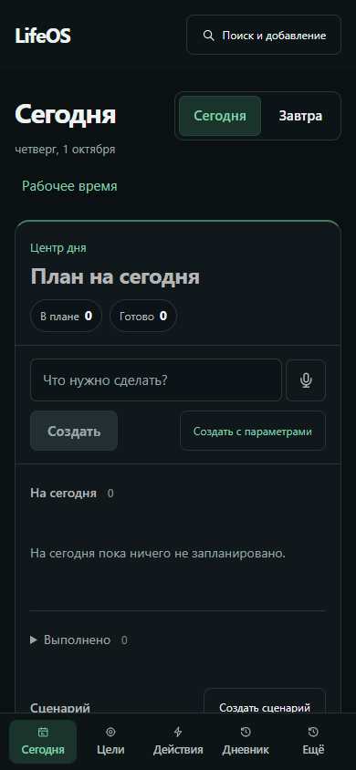
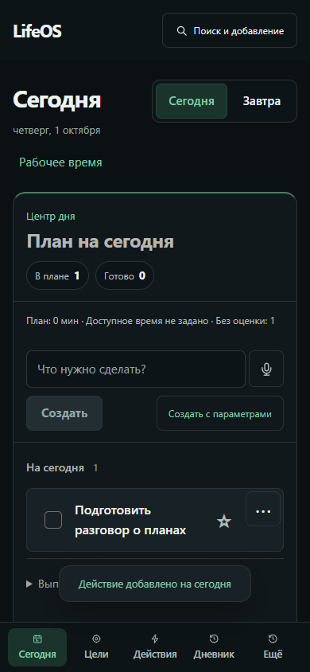
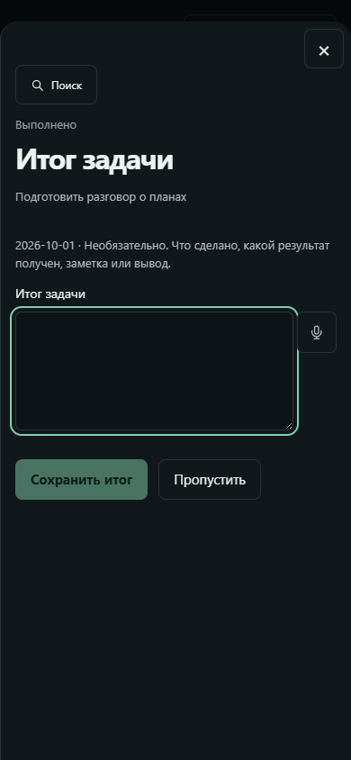
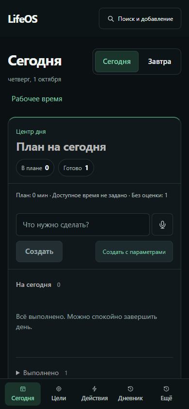
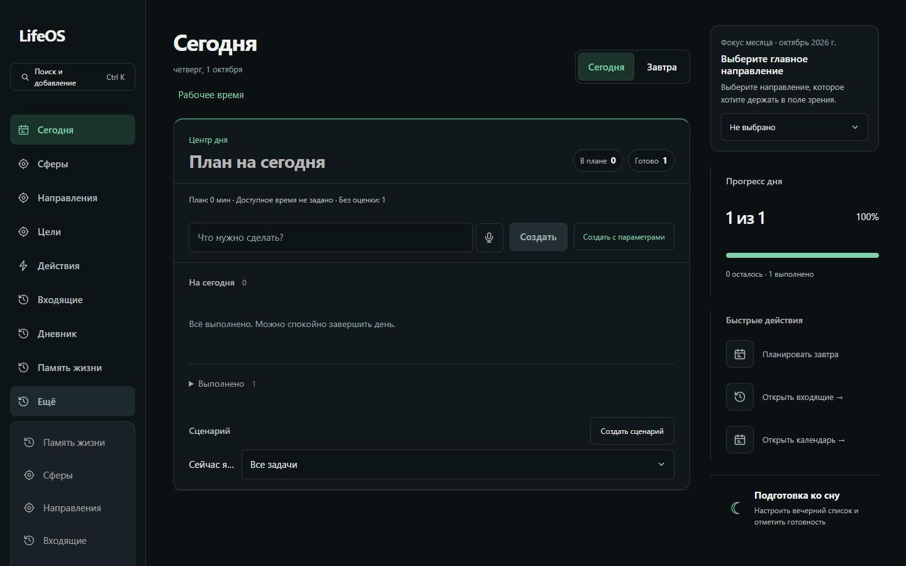
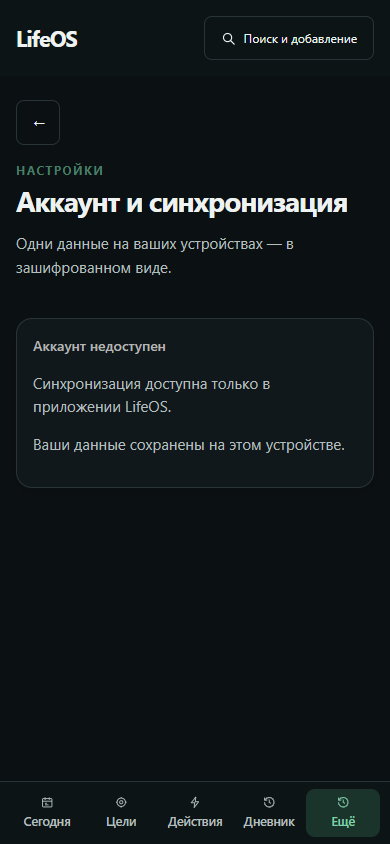
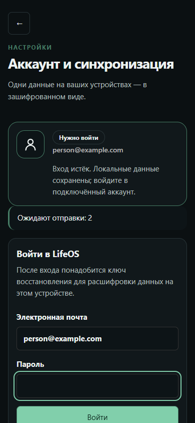
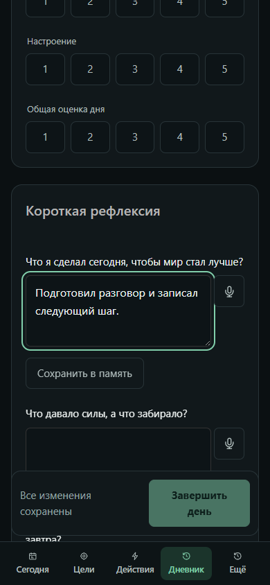

# UX-проверка обратной связи LifeOS

Дата: 01.10.2026. Экспертный проход текущего интерфейса, **до реализации обновления**.
[Спецификация](../../features/2026-10-01-clear-feedback.md) ·
[Подробный план](../../../superpowers/plans/2026-10-01-clear-feedback.md).

## Итог

Создание, выполнение и автосохранение уже дают обратную связь. Основная возможность улучшения
в выбранном scope — доступ к существующей странице состояния данных и возврат к работе.
Обнаружимость нельзя объявить доказанной без пользовательского прогона, но объективно в desktop
ссылка аккаунта находится ниже viewport даже после открытия «Ещё».

Работающие уведомления/сохранение не требуют повторной реализации. Исключённые из нового плана
исправления статусов здесь не считаются решёнными. Нового UX ещё нет, его приёмка впереди.

## Метод и ограничения

- Приложение: активный `D:/LifeOS-App`, контролируемый Vite на `http://127.0.0.1:4174/`.
  Worktree содержит предыдущие незакоммиченные обновления; продуктовый код в этом audit не менялся.
- Встроенный CUA и node-repl tool не запустились: `failed to write kernel assets`, os error 3.
  Использован локальный Chrome через установленный Playwright и shell Node REPL, отдельные
  browser contexts на 1440×900 и 390×844. Личные browser profiles/данные/облако не использовались.
- В каждом шаге прочитан актуальный DOM, сохранены desktop/mobile снимки; все 16 файлов открыты
  и просмотрены. Ни один старый screenshot не использован как evidence этого прохода.
- После проверки Chrome/REPL закрыты, созданный Vite остановлен.
- Это экспертная UX-проверка. Реальные участники не приглашались; время поиска/успешность
  понимания человеком не измерялись. Полное соответствие WCAG не заявляется.
- Нет реальной native/cloud сессии, проверки доставки между устройствами, screen reader,
  настоящей экранной клавиатуры телефона или измерения всех contrast ratios.
- В этом проходе не инъецировались ошибки записи/refresh. Recovery проверен только как
  доступная форма в существующем fixture с истёкшим входом; вход не выполнялся.

Метрики: [evidence.json](evidence.json); Tab-переходы: [keyboard.json](keyboard.json).
DOM каждого состояния сохранён в одноимённых `.txt` рядом со снимками.
Общих page/console errors не обнаружено; `scrollWidth == viewport width` во всех 16 состояниях.

## Проход по шагам

### 1. Открыть «Сегодня» — понятно

План, счётчики и поле добавления доступны сразу. Пустое состояние объясняет отсутствие задач.
Отдельного состояния обмена в рабочем экране нет. Это наблюдение о размещении, не вывод
об отсутствии синхронизации в приложении.

[Desktop](01-today-1440.png). Route: `/#/v2/today`.

### 2. Создать действие — результат уже виден

Введено «Подготовить разговор о планах», нажато «Создать». Действие появилось, «В плане» стало 1,
показано «Действие добавлено на сегодня». Новая система подтверждения ради этого сценария не нужна.
На mobile notice временно накрывает область строки «Выполнено»; это вторичный UX-риск текущего
toast, а не основание включать его переработку в согласованный узкий scope.

[Desktop](02-created-1440.png).

### 3. Выполнить действие — результат и необязательный итог различимы

Нажат checkbox. Открывается «Итог задачи», есть пометка «Выполнено», пояснение «Необязательно»
и «Пропустить». Focus в поле итога, следующий Tab ведёт к голосовому вводу, затем к «Пропустить».
Desktop notice виден под затемнённым фоном, но результат также сообщён внутри dialog.
Повторную систему completion в этом обновлении планировать не нужно.

[Desktop](03-completed-summary-1440.png).

### 4. Пропустить итог и вернуться к плану — выполнено

После «Пропустить» в плане 0, готово 1; текст «Всё выполнено». На desktop прогресс 1 из 1,
100%. На mobile подробный прогресс ниже, но счётчик «Готово 1» доступен сверху.
Существующая обратная связь уже покрывает результат выполнения.

[Desktop](04-return-to-plan-1440.png).

### 5. Найти состояние данных — доступ затруднён на desktop

Сначала нужно открыть «Ещё». Ссылка «Аккаунт и синхронизация» расположена последней.
На mobile она видна, на desktop её верхняя граница — 961.8 px при высоте viewport 900 px,
то есть нужен дополнительный scroll. В desktop меню также повторяет несколько уже видимых
основных ссылок; их общая перестройка вне данного scope.

Рекомендация: прямой desktop-вход после QuickAccess, mobile-вход первым пунктом «Ещё».
Нейтральное имя «Состояние данных» сообщает назначение, не обещая «всё сохранено».

[Mobile](05-more-menu-390.png).

### 6. Открыть аккаунт — ограничение browser build объяснено

Видны «Аккаунт недоступен» и причина: синхронизация доступна только в приложении LifeOS.
Это корректное ограничение проверки: настоящее состояние облака в этом контексте не проверялось.
Кнопка возврата доступна; текущая реализация возвращает в Today. Новый план отдельно проверит
возврат к исходному route при входе из Diary/Actions.

[Desktop](06-account-1440.png). Route: `/#/v2/account`.

### 7. Понять следующее действие при истёкшем входе — форма уже есть

Открыт существующий `/tests/fixtures/account-sync.html?state=sign-in-required`.
Виден статус «Нужно войти», 2 ожидающих изменения и форма «Войти в LifeOS»; поясняется необходимость
ключа восстановления после входа. Не вводились реальные данные, не выполнялась авторизация.
Смысл счётчика можно уточнить в ready-блоке, но универсальную recovery-функцию создавать не требуется.

[Desktop](07-sign-in-required-fixture-1440.png). Этот fixture не содержит общей shell и не доказывает
готовность native sync или его discoverability из рабочего экрана.

### 8. Ввести запись дневника — автосохранение уже работает

Введено «Подготовил разговор и записал следующий шаг». Показан сохранённый статус, затем
после reload на обоих размерах текст остался в поле. На mobile строка сохранения закреплена
над нижней навигацией и видна при редактировании. На desktop статус расположен после длинной
формы, на `y=1150.1` при высоте 900 px, поэтому у первого поля его не видно.

Это отдельная возможность улучшения размещения статуса дневника, за пределами узкого плана
доступа к состоянию данных. Уже имеющуюся mobile-строку не нужно создавать повторно.

[Desktop](08-diary-saved-1440.png). Route: `/#/v2/diary?period=day&date=2026-10-01`.

## Приоритеты и связь с планом

| Наблюдение                                          | Приоритет                                              | Решение                                                            |
| --------------------------------------------------- | ------------------------------------------------------ | ------------------------------------------------------------------ |
| Account ниже viewport в desktop-меню                | Основной UX-пробел этого scope                         | Новый прямой вход, menu entry первым на mobile                     |
| Текущий Back ведёт в Today                          | Важен для входа из других разделов; установлен по коду | Return route и отдельная browser-приёмка                           |
| Неочевидное различие локального сохранения и обмена | Гипотеза понимания, не подтверждённая участниками      | Короткое пояснение и пользовательское задание                      |
| Notice временно перекрывает второстепенный control  | Вторичное улучшение                                    | Вне текущего scope                                                 |
| Desktop-статус Diary ниже первого viewport          | Отдельное улучшение                                    | Вне текущего scope; mobile-решение сохранить                       |
| Ошибки расчёта статусов из прежнего исследования    | Не перепроверены этим UI-проходом                      | Исключены по принятому пониманию запроса, не считать исправленными |

## Что проверять после реализации

Путь до состояния — 1 клик desktop / 2 mobile; target ≥44 px; первый action Today не сдвигается;
guard нельзя обойти; return сохраняет route/date; новые labels переносятся на 320 px;
Tab/Enter/Escape и visible focus работают. На controlled fixture проверить loading/error/local/
ready/offline/pending/sign-in/recovery. Экспертный проход дополнить коротким заданием пользователю;
результат не заменять предположением о понятности текста.

## Реализация и повторный проход

Обновление реализовано и проверено в browser на 1440×900, 1280×720, 390×844 и 320 px. [Отчёт о проверке](../../../architecture/2026-10-01-data-status-ux-verification.md) содержит результат, снимки `implementation-*.png`, контраст и оставшуюся ручную QA. Этот исходный audit сохранён как baseline до изменения.
